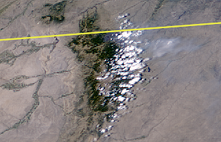
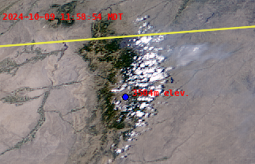
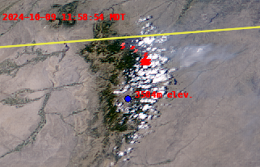

   
 


# GoesVideo
___
This package is a convenience wrapper for [Satpy](https://github.com/pytroll/satpy) to facilitate quick and simple 
creation of animated scenes from the GOES geostationary satellites. It handles downloading, compositing and animating of
GOES imagery. Also, editing tools are provided to perform georeferenced manipulations and annotations of animated scenes. 

## Installation
___
GoesVideo can be installed from PyPi using pip:

```python
pip install goesvideo
```

## Example Usage
___
To highlight the capabilities of GoesVideo, we will look at some GOES-East imagery near 
Big Horn, WY during the time period of early October 2024 when 
several large wildfires erupted. 

First, we define the bounding box coordinates for the area of 
interest in the order of (west, south, east, north):

```python
bbox = (-108.09, 43.794, -106.43, 45.25)
```
Next, we can easily create composite images and video of this area in the 
time frame of interest:

```python
from goesvideo import GoesAnimator
from pathlib import Path

basedir = str(Path.home()) + '/goesimagery'
am = GoesAnimator('goes-east', 'conus', 'ABI-L2-CMIP', base_dir=basedir)
# Adding coastlines requires shapefile path to be specified
# Shapefiles can be downloaded here: https://www.soest.hawaii.edu/pwessel/gshhg/
coastopts = {'level_coast': 1, 'level_borders': 2}
am.compositor.set_coastlines_options(path=coastpath, **coastopts)
am.create_video('true_color_with_night_ir_custom',
                start_time='2024-10-08 12:00:00',
                end_time='2024-10-11 05:00:00',
                folder_name='Big_Horn_WY',
                bbox=bbox,
                interval=1,
                coastlines=True,
                res='auto',
                codec='rawvideo',
                fps=20
                )
```
That's all there is to it! Here's a screenshot of one of the composited images:



Now, let's add some annotations to the image frames in our video:

```python
from goesvideo.addons.sceneeditor import GoesSceneEditor

editor = GoesSceneEditor(basedir, 'Big_Horn_WY', session_name='Big_Horn_WY_edit1')
# fontpath should be path to a ttf font
editor.set_font(fontpath, (255, 0, 0), 20)

# Add timestamp to each video frame
editor.add_timestamps('upper-left', pytz.timezone('US/Mountain'), preview=False)

# Add circle at specified lat/lon position
circleopts = {"radius": 7, "fill": (0, 0, 255), "outline": (0, 0, 0), "width": 1}
editor.add_annotation(
    "circle",
    ("44d21m56s N", "107d10m28s W"),
    label="3504m elev.",
    labelopts={"fontsize": 15, "padding": (15, 15)},
    **circleopts,
)
editor.process_annotations(preview=False)
editor.to_video(codec='rawvideo', fps=20)
```
The `GoesSceneEditor` copies over the composited images from the `Big_Horn_WY` folder to a designated session folder where
annotations can be applied. After all of the images have been
edited, a new output video is created. Here is a screenshot:



If desired, further modifications can be made by `GoesSceneEditor` including recropping to new boundary coordinates, resizing and 
reprojection in a different CRS.

```python
editor.recrop((-107, 44, -106.9, 44), preview=False)
editor.resize(1024, 768, preview=False)
editor.reproject("EPSG:4326", preview=False)
```
Finally, `GoesSceneEditor` can produce overlay videos using images from another editor instance. This can be useful when 
visualizing hot spots detected by the FDC product available from the GOES 
ABI. 

```python
fdc_comp = GoesCompositor('goes-east', 'conus', 'ABI-L2-FDC', base_dir=basedir)
fdc_comp.create_composites('Power',
                           start_time='2024-10-08 12:00:00',
                           end_time='2024-10-11 05:00:00',
                           folder_name='Big_Horn_WY_Fire_Detection',
                           bbox=bbox,
                           output_format='geotiff'
                           )
oleditor = GoesSceneEditor(basedir, 'Big_Horn_WY_Fire_Detection', session_name='Big_Horn_WY_Fire_Edit_1')
editor.add_overlay(oleditor, opacity=0.8, cumulative=True, overlay_session_name='Big_Horn_Overlay')
editor.to_video(codec='rawvideo', fps=20)
```
The output video shows the fire detection overlay as red pixels. The `cumulative` option forces a hotspot to remain in the 
video after its first appearance.



Finally, a note about the folder structure used by GoesVideo. There are four primary folders that are generated by the 
package under the user-provided basedir: `goesdata` for storage of downloaded nc files, `Scenes` to store images composited
by `GoesCompositor` and `GoesAnimator`, `SceneEdits` to store edit sessions produced by `GoesSceneEditor` and `Videos` to
store output videos. For the specific example described above, the tree ends up looking something like this:
```bash
.
├── goesdata                            [nc files]
├── SceneEdits                          [Image edits by GoesSceneEditor]
│   ├── Big_Horn_WY                     
│   │   ├── Big_Horn_Overlay           
│   │   └── Big_Horn_WY_edit1           
│   └── Big_Horn_WY_Fire_Detection      
│       └── Big_Horn_WY_Fire_Edit_1     
├── Scenes                              [Scenes composited by GoesCompositor or GoesAnimator]    
│   ├── Big_Horn_WY                     
│   └── Big_Horn_WY_Fire_Detection
└── Videos                              [Videos generated by GoesAnimator or GoesSceneEditor]
    └── Big_Horn_WY                     
        ├── Big_Horn_Overlay
        │   └── video.avi
        ├── Big_Horn_WY_Edit1
        │   └── video.avi
        └── video.avi

```
The subfolders under `Scenes` each contain two files, `metadata.json` and `timestamps.csv`, that are automatically generated during 
compositing. For proper functioning of the package, these files should not be altered. In fact, there should be no reason 
for the user to need to directly alter anything located under the `Scenes` folder.

There is one additional file needed for the package to function correctly `etc/abibands.yaml`, which is intended to mirror`abi.yaml`
found in the Satpy package. This file may need to be manually updated if custom compositors are added to `abi.yaml` 